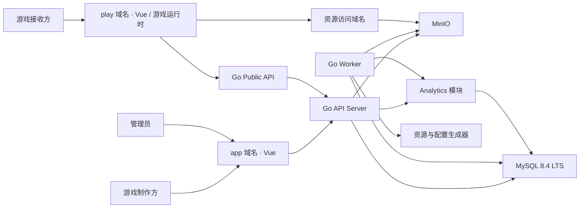
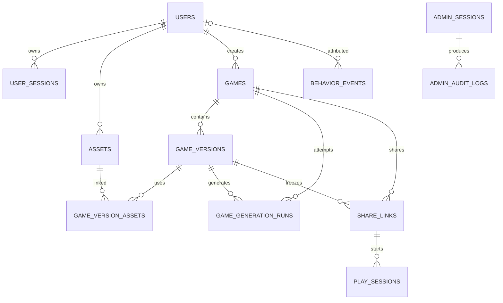
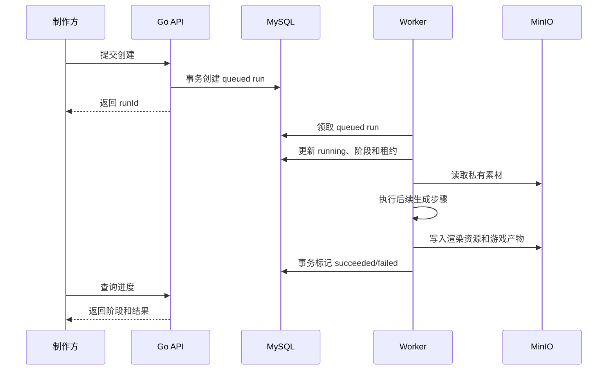

# 个性化游戏生成与分享平台技术实现方案

## 文档信息

- 版本：MVP v0.1
- 状态：技术基线（阶段 1–5 实现差异见 [MVP_IMPLEMENTATION_STATUS.md](./MVP_IMPLEMENTATION_STATUS.md)）
- 更新日期：2026-08-23
- 产品需求依据：[PRD_MVP_v0.1.md](./PRD_MVP_v0.1.md)
- 适用范围：MVP 的工程结构、系统架构、数据库、接口、认证、存储、异步任务、部署、安全与测试
- AI 平台与模型选择见：[MVP 整体技术选型](./TECHNOLOGY_SELECTION_MVP_v0.1.md)
- 游戏模板、基础引擎和运行时边界见：[游戏模板与运行时契约](./GAME_TEMPLATE_RUNTIME_CONTRACT_v0.1.md)
- 暂不定义：各具体模板的最终美术、提示词、游戏生成算法及生成质量标准

## 1. 设计结论

### 1.1 已确认的基础技术

- 前端使用 Vue。
- 后端使用 Go。
- 关系型数据库使用 MySQL。
- 用户照片、头像和游戏产物使用 MinIO。
- 项目从 `game-gen` 目录独立开发，不使用 OpenGame。
- 管理员用户名和密码由程序配置提供，MVP 不建立管理员注册系统。
- 游戏代码固定在平台发布物中：前端提供一组受信任的静态模板，每套模板拥有独立页面和流程代码，并可组合拼图、翻牌等多个基础 2D 游戏引擎。创建过程只生成图片等个性化资源和结构化游戏配置，不生成或执行任意 HTML、CSS 或 JavaScript。
- 多套模板可以使用同一种基础玩法，但只共享稳定的规则与状态引擎，不强制共享具体页面设计。
- 用户上传的图片作为图生图参考素材；用户输入文本按所选模板的字段约束直接进入游戏配置。创建任务不调用 AI 自动生成游戏文案，也不执行文生图。图生图结果由 Worker 写入所选 Vue 模板使用的游戏资源。
- MVP 不设置图片数量、单张文件大小、单个版本总大小和像素尺寸等产品级配额。
- 自定义分享链接最长 90 天；链接有效时已开始的一局最长继续 30 分钟。
- 制作方试玩与公开游玩的实际 `playing` 阶段使用覆盖浏览器可视区域的沉浸式全视口舞台；该能力不依赖浏览器 Fullscreen API。

### 1.2 本文采用的推荐默认方案

| 领域 | 推荐方案 |
|---|---|
| 仓库组织 | 单仓库，前后端与部署文件统一管理 |
| 前端 | Vue 3、TypeScript、Vite、Vue Router、Pinia |
| UI 组件 | Element Plus，业务页面允许使用自定义主题和组件 |
| Go 版本 | Go 1.26.x，使用当前受支持的最新补丁版本 |
| HTTP 层 | 标准库 `net/http` + `go-chi/chi` |
| 数据访问 | 当前使用 `database/sql` + MySQL Driver 手写 Repository；保留 `sqlc` 配置供后续引入 |
| 数据库迁移 | `golang-migrate/migrate`，显式版本化 SQL 迁移 |
| MySQL | MySQL 8.4 LTS、InnoDB、`utf8mb4`、UTC 时间 |
| MinIO 客户端 | 官方 Go SDK，所有 Bucket 默认私有 |
| 密码保存 | Argon2id 哈希 |
| 登录状态 | 服务端会话 + 安全 Cookie，不使用浏览器 Local Storage 保存认证凭据 |
| 异步任务 | MySQL 任务表 + 独立 Go Worker，MVP 不引入 Redis |
| 创建进度 | 前端定时查询，MVP 不使用 WebSocket |
| 游戏运行 | 受信任模板注册表 + 独立模板代码 + 共用基础引擎 + 版本化 JSON 配置和个性化资源 |
| 日志 | Go `slog` 输出 JSON 结构化日志 |
| 本地环境 | Docker Compose |
| 生产入口 | HTTPS 反向代理 + 静态前端 + Go API + Go Worker |

Vue 官方脚手架直接支持 Vite、TypeScript、Vue Router、Pinia 和测试工具；Go 1.26 与 MySQL 8.4 LTS 当前均处于官方支持范围。依赖的具体补丁版本在创建工程时锁定，不在本文写死。

## 2. 架构原则

1. **先采用模块化单体**：认证、用户、游戏、分享和后台位于同一 Go 工程中，不提前拆分微服务。
2. **API 与 Worker 分离运行**：两者共享业务代码，但耗时游戏创建不占用 HTTP 请求。
3. **业务模块拥有自己的规则**：后台管理模块只能调用用户、游戏和分享模块提供的用例，不能绕过业务规则直接修改数据。
4. **数据库保存状态，MinIO 保存文件**：MySQL 不保存图片二进制，MinIO 不承担业务状态查询。
5. **公开分享与私有工作台隔离**：分享页只能获取经过公开接口筛选的数据。
6. **敏感内容最小暴露**：后台查询、日志和错误记录不得包含原始照片、用户输入文本、生成文本素材、分享凭据或签名下载地址。
7. **删除对用户立即生效**：删除后游戏不可访问、不可恢复；底层对象清理可由可靠任务短暂异步完成。
8. **模板、引擎与数据分离**：模板是经过审核并随前端发布的独立静态代码，基础玩法只复用规则和状态引擎；Worker 只能生成符合对应模板版本 Schema 的配置和资源。
9. **为游戏运行安全预留独立边界**：即使不执行生成代码，公开游戏页面仍不得接触制作方或管理员登录会话。

## 3. 整体系统架构



### 3.1 运行程序

#### Vue Web

一个前端工程产生一套构建产物，根据域名和路由承载：

- 制作方认证页面。
- 制作方工作台。
- 管理员后台。
- 当前的公开分享开场页。
- 后续的游戏运行页面。

生产环境建议分别通过 `app` 和 `play` 域名提供页面。即使构建产物相同，浏览器的 Cookie 和运行上下文也要隔离。

#### Go API Server

负责：

- 制作方和管理员认证。
- 用户资料。
- 游戏、版本和素材元数据。
- 创建任务提交与状态查询。
- 分享链接管理与公开访问校验。
- MinIO 临时访问授权。
- 管理后台查询和操作。

#### Go Worker

负责：

- 获取等待执行的游戏创建任务。
- 更新任务真实状态和租约心跳，不模拟预计百分比。
- 调用资源与配置生成器。
- 保存图生图 PNG 资源、用户输入文本和版本化游戏配置。
- 使用当前版本化 Schema 和后端解码器校验模板标识、情书、4 位数字密码、提示与配置完整性；新增模板字段时同步更新 OpenAPI、前后端类型和测试。
- 记录成功或脱敏失败结果。
- 恢复因 Worker 中断而失去租约的任务。
- 清理永久删除游戏的 MinIO 对象。
- 清理过期会话和一次性认证凭据。

Worker 不暴露公网 HTTP 业务接口，仅提供内部健康检查。

## 4. 项目目录

```text
game-gen/
├── frontend/
│   ├── public/
│   ├── src/
│   │   ├── api/                    # HTTP 客户端和接口类型
│   │   ├── assets/                 # 前端自带的静态资源
│   │   ├── components/             # 跨功能通用组件
│   │   ├── layouts/
│   │   │   ├── AuthLayout.vue
│   │   │   ├── CreatorLayout.vue
│   │   │   ├── PlayLayout.vue
│   │   │   └── AdminLayout.vue
│   │   ├── features/
│   │   │   ├── auth/
│   │   │   ├── game-create/
│   │   │   ├── games/
│   │   │   ├── sharing/
│   │   │   ├── settings/
│   │   │   ├── play/
│   │   │   └── admin/
│   │   ├── game-runtime/           # 受信任模板、共用引擎与平台运行时
│   │   │   ├── runtime/            # 会话、素材、生命周期、错误边界
│   │   │   ├── engines/            # 无模板视觉的拼图、翻牌等基础引擎
│   │   │   ├── templates/          # 每套模板的独立页面与流程代码
│   │   │   │   ├── registry.ts
│   │   │   │   └── memory-game/
│   │   │   ├── config/
│   │   │   └── devtools/           # 模板与单关卡预览工具
│   │   ├── router/
│   │   ├── stores/
│   │   ├── styles/
│   │   ├── types/
│   │   ├── utils/
│   │   ├── App.vue
│   │   └── main.ts
│   ├── tests/
│   │   ├── unit/
│   │   └── e2e/
│   ├── package.json
│   ├── tsconfig.json
│   └── vite.config.ts
│
├── backend/
│   ├── cmd/
│   │   ├── api/
│   │   │   └── main.go
│   │   └── worker/
│   │       └── main.go
│   ├── internal/
│   │   ├── auth/
│   │   │   ├── handler.go
│   │   │   ├── service.go
│   │   │   ├── repository.go
│   │   │   └── models.go
│   │   ├── users/
│   │   ├── games/
│   │   ├── assets/
│   │   ├── generations/
│   │   ├── shares/
│   │   ├── gameconfig/             # 配置生成、Schema 校验与版本兼容
│   │   ├── admin/
│   │   ├── audit/
│   │   ├── analytics/             # 行为事件校验、写入和管理员查询
│   │   ├── cleanup/
│   │   ├── platform/
│   │   │   ├── config/
│   │   │   ├── database/
│   │   │   ├── encryption/
│   │   │   ├── logging/
│   │   │   ├── mail/
│   │   │   ├── storage/
│   │   │   └── identifiers/
│   │   └── server/
│   │       ├── middleware/
│   │       ├── routes.go
│   │       └── server.go
│   ├── db/
│   │   ├── migrations/             # 手写、版本化 SQL
│   │   ├── queries/                # sqlc SQL 查询
│   │   └── generated/              # sqlc 生成代码
│   ├── tests/
│   │   ├── integration/
│   │   └── fixtures/
│   ├── go.mod
│   ├── go.sum
│   └── sqlc.yaml
│
├── deploy/
│   ├── docker/
│   │   └── app.Dockerfile          # API、Worker、迁移和前端统一业务镜像
│   ├── compose/
│   │   ├── dev/
│   │   │   ├── compose.yaml
│   │   │   ├── .env.example
│   │   │   └── README.md
│   │   └── prod/                   # 单机生产编排、Caddy 和 MinIO 策略
│   │       ├── compose.yaml
│   │       ├── Caddyfile
│   │       ├── minio-app-policy.json
│   │       ├── .env.example
│   │       └── README.md
│
├── contracts/
│   ├── openapi/
│   │   └── openapi.yaml
│   └── game-config/
│       ├── v1.schema.json          # 当前版本化游戏配置 Schema
│       ├── envelope/               # 目标：稳定配置信封 Schema
│       ├── templates/              # 目标：按模板 ID 和版本组织的 Schema
│       └── examples/
│
├── docs/
│   ├── PRD_MVP_v0.1.md
│   ├── TECHNICAL_DESIGN_MVP_v0.1.md
│   └── GAME_TEMPLATE_RUNTIME_CONTRACT_v0.1.md
│
├── config/
│   ├── config.example.yaml
│   └── config.local.yaml           # 不提交 Git
├── scripts/
├── .env.example
├── .gitignore
├── Makefile
└── README.md
```

后端目录采用“按业务功能组织”，每个模块内部包含自己的 HTTP Handler、Service、Repository 和模型。不要在项目根部建立共享的巨型 `controllers`、`services` 和 `models` 目录。

## 5. 业务模块职责

### 5.1 `auth`

- 使用管理员一次性邀请码完成登录 ID 注册、登录、退出。
- 密码修改。
- 制作方会话创建、验证、撤销和过期清理。
- CSRF 凭据管理。

注册邀请码使用 `XXXX-XXXX` 格式的密码学随机值。数据库只保存 SHA-256 哈希和末四位脱敏标识；注册事务使用 `SELECT ... FOR UPDATE` 锁定未使用且未撤销的邀请码，在同一事务中创建用户并写入 `used_by_user_id + used_at`，保证并发请求最多成功一个，且用户创建失败时不会消耗邀请码。

### 5.2 `users`

- 用户资料、昵称和头像。
- 用户状态 `active`、`disabled`。
- 管理后台用户列表和详情所需的用户查询。

### 5.3 `games`

- 游戏草稿。
- 游戏基本信息。
- 游戏版本。
- 用户历史游戏。
- 当前游戏和当前创建任务状态。
- 编辑与永久删除的业务规则。

### 5.4 `assets`

- 图片接收、校验、规范化和保存。
- 头像、封面、原始素材、渲染素材和游戏产物分类。
- MinIO 对象元数据。
- 私有对象临时访问地址。
- 素材归属检查。

### 5.5 `generations`

- 创建任务提交。
- 阶段、进度和任务状态。
- Worker 任务领取和租约。
- 用户重试。
- 创建成功、失败和取消记录。
- 错误分类、脱敏和管理员查询。

### 5.6 `shares`

- 分享链接创建、查询、重新分享和撤销。
- 分享有效期。
- 分享凭据验证。
- 公开分享信息。
- 当前一局的临时游玩会话。
- 公开游戏清单和渲染资源授权。

### 5.7 `admin`

- 配置管理员的登录和退出。
- 后台概览。
- 用户、游戏和失败记录的管理视图。
- 停用或恢复用户。
- 停止分享链接。

### 5.8 `audit`

- 管理员关键操作记录。
- 后台“系统记录”查询。
- 审计元数据的字段白名单和脱敏。

### 5.9 `cleanup`

- 永久删除游戏的异步物理清理。
- 孤立 MinIO 对象清理。
- 过期会话清理。

### 5.10 `gameconfig`

- 定义稳定的游戏配置信封，以及每个受信任模板版本可接受的配置字段、文本槽位和资源槽位。
- 维护 `templateId + templateVersion` 到模板 Schema 的精确映射。
- 生成配置并验证模板标识、模板版本、配置版本、文本槽位、素材绑定及资源归属。
- 拒绝未知字段、未知资源槽位和不兼容版本。
- 只产生数据，不产生 HTML、CSS、JavaScript 或其他可执行代码。
- 为前端模板注册表、历史版本和基础引擎提供兼容性测试样例。

### 5.11 `analytics`

- 定义经 G1 独立复查后冻结的行为事件名、来源、行为主体、关联和属性白名单。
- 校验前端 `clientEventId`、客户端发生时间、属性类型和值域，并限制属性 JSON 最大 4 KB。
- 提供最小 `Recorder` 接口，使 API、Sharing 和 Worker 只依赖 best-effort 记录能力，不依赖完整查询 Repository。
- 保存服务端接收时间，并按 `clientEventId` 实现前端事件幂等。
- 为管理员提供按事件、Creator ID、登录 ID、游戏、来源和时间的稳定游标查询。
- 保证事件记录与 `admin_audit_logs` 相互独立，不保存登录 ID 副本或用户敏感正文。
- Analytics 写入失败只产生脱敏结构化 warning，不回滚或改变主业务结果。

## 6. 前端设计

### 6.1 路由

```text
/auth/register
/auth/login

/app/create
/app/games
/app/games/:gameId/edit
/app/games/:gameId/generation/:runId
/app/games/:gameId/preview            # versionId 通过查询参数传入
/app/games/:gameId/share
/app/settings

/play/:publicId

/admin/login
/admin
/admin/invitation-codes
/admin/ai-settings
/admin/behavior-events
```

### 6.2 路由权限

- `/auth/*`：无需登录；已登录制作方访问登录页时跳转工作台。
- `/app/*`：需要有效制作方会话。
- `/play/*`：公开访问，只能使用分享公开接口。
- `/admin/login`：无需管理员会话。
- `/admin/*`：需要有效管理员会话。

前端路由守卫只负责用户体验，真正的身份和权限检查必须由每个后端接口执行。

### 6.3 状态管理

Pinia 仅保存跨页面状态：

- 当前制作方资料。
- 当前管理员登录状态。
- CSRF 状态。
- 创建游戏的临时表单状态。

服务器数据以 API 返回为准。认证 Session ID、重置凭据和分享凭据不得写入 `localStorage`。

### 6.4 创建进度

- 创建中每 1.2 秒查询一次当前路由指定的运行。
- `succeeded`、`failed`、`cancelled` 后停止查询。
- 网络中断时保留最后状态并显示读取错误；只要最后状态仍是 `queued` 或 `running` 就继续查询，不错误标记为创建失败。
- “我的游戏”只展示游戏聚合状态，不包含运行 ID，也不恢复历史生成页面。

后续如需更及时的进度，可以改用 Server-Sent Events；当前无需 WebSocket。

### 6.5 响应式与移动端优先

- 所有制作端、认证、公开游玩和管理页面必须覆盖最小 `320px` 视口，不允许页面级横向滚动。
- `320px–700px` 使用手机单列布局；制作端主导航固定在底部，并通过 `safe-area-inset-bottom` 适配全面屏设备。
- `701px–960px` 使用平板过渡布局，`961px` 以上启用桌面多列布局。
- 手机端主要按钮、输入框、选择器和导航目标的最小触控高度为 44px。
- 创建/修改页的上传和提交、独立分享页以及危险操作在窄屏上改为纵向全宽排列；“我的游戏”卡片固定四个操作且不得横向溢出。
- 制作方试玩和公开游玩进入 `playing` 状态后使用固定定位的全视口游戏层：`inset: 0`、`100vw × 100dvh`、锁定 `body` 页面滚动，并覆盖制作端导航、公开开场卡片和其他产品界面。竖屏模板在桌面端可以保持模板最大宽度并水平居中。
- 制作方全屏试玩层必须提供适配安全区域的退出按钮；手机端需要为该按钮预留顶部信息空间，不能遮挡模板关卡进度。公开游玩不展示制作方退出控件。
- CI 继续执行类型、Lint 与构建检查；浏览器 E2E 阶段至少覆盖 `320×800` 与 `1440×900` 两种视口。

## 7. 认证与会话

### 7.1 制作方密码

- 密码只保存 Argon2id 哈希，不保存明文或可逆密文。
- 每个密码使用独立随机 Salt。
- 参数以部署机器上的基准测试为准，单次验证目标约 250–500 ms，并且不低于 OWASP 当前最低建议。
- 密码长度默认 8–128 个 Unicode 字符。
- 不强制“必须同时包含大小写、数字和符号”的复杂度规则。
- 修改密码或完成密码重置后撤销该用户的全部现有会话，要求重新登录。

### 7.2 制作方会话

采用不透明随机会话：

1. 登录成功后生成 32 字节密码学安全随机值。
2. 浏览器只在 Cookie 中保存原始随机值。
3. MySQL 只保存该值的 SHA-256 哈希。
4. 每次请求对 Cookie 值进行哈希后查询有效会话。
5. 退出登录将会话撤销。

Cookie 推荐值：

```text
Name: __Host-creator_session
Secure: true（生产环境）
HttpOnly: true
SameSite: Lax
Path: /
Domain: 不设置
默认有效期: 30 天
```

登录 Session ID 不得放在 URL、Local Storage 或 Session Storage 中。分享链接中的公开凭据使用 URL Fragment，由前端读取后通过 POST Body 提交，避免凭据进入常规服务器访问日志。

### 7.3 应用层内容加密

- 用户输入文本、生成参数和需要再次展示的分享 Secret 使用 AES-256-GCM 加密。
- 每条记录使用独立的 12 字节随机 Nonce。
- 用户输入内容与分享 Secret 使用相互独立的 32 字节密钥；也可以从外部主密钥按不同用途派生，不能直接复用同一个业务密钥。
- 密钥通过部署 Secret 提供，不保存在 MySQL、Git 或镜像中。
- 密文记录保存密钥版本，以便以后轮换。
- 只有明确需要内容的制作方用例和游戏创建 Worker 可以解密用户输入文本。
- 管理员、列表、日志和错误处理代码不得调用解密能力。

### 7.4 CSRF

- 每个会话持有独立 CSRF 随机值的哈希。
- 前端初始化会话时请求短期 CSRF 值。
- 所有会改变状态的请求通过 `X-CSRF-Token` Header 提交。
- 后端同时校验 CSRF 值、`Origin` 和允许的 Host。
- 登录和注册接口也实施 Origin 检查和请求频率限制。

### 7.5 登录 ID 与账号恢复边界

- 登录 ID 是全局唯一、不可修改的登录标识，并与内部 Creator ULID 主键分离。
- 接收输入后先去除首尾空白并转为小写，按 `^[a-z][a-z0-9_-]{2,31}$` 校验。
- `admin`、`administrator`、`root`、`support` 和 `system` 为保留值。
- 公开分享接口不返回登录 ID 或 Creator ID，登录日志不记录密码。
- MVP 不提供忘记密码或自助恢复；用户必须妥善保存凭据。后续如增加恢复码或管理员协助恢复，需独立安全设计和审计。

### 7.6 管理员认证

管理员凭据读取自本地配置或环境变量：

```yaml
admin:
  username: admin
  password_hash: "${ADMIN_PASSWORD_HASH}"
```

- 仓库只提交占位配置。
- 实际密码哈希不提交 Git。
- 不建议在生产配置中保存管理员明文密码。
- 管理员会话与制作方会话使用不同的 Cookie 和数据库表。
- 管理员会话默认有效期 8 小时。
- 管理员密码哈希配置变化后，旧会话通过凭据指纹自动失效。
- 管理员登录限制为连续 5 次失败后短暂冷却，并记录成功登录及管理操作。

管理员 Cookie：

```text
Name: __Host-admin_session
Secure: true（生产环境）
HttpOnly: true
SameSite: Strict
Path: /
Domain: 不设置
```

### 7.7 登录频率限制

- MVP 单 API 实例使用进程内 Token Bucket，并由反向代理增加 IP 级限制。
- 制作方登录同时按规范化登录 ID 和客户端 IP 限制；日志不记录明文密码。
- 管理员登录采用更严格限制和短暂递增冷却。
- 如果未来运行多个 API 实例，需要把共享限流状态迁移到 Redis 或专用网关；MySQL 业务表不承担高频限流计数。

## 8. 数据库设计

### 8.1 通用约定

- MySQL 8.4 LTS。
- 所有业务表使用 InnoDB。
- 字符集使用 `utf8mb4`。
- 所有时间使用 UTC 和 `DATETIME(6)`，API 返回 ISO 8601。
- 业务 ID 使用 26 字符 ULID，便于日志排查并避免连续数字 ID。
- ULID 等机器标识列使用 ASCII 二进制排序规则；哈希和随机字节使用二进制列。
- 不依赖 MySQL `ENUM`，状态使用 `VARCHAR` 并由应用和约束共同校验。
- 金额暂未涉及。
- 核心查询字段使用普通列，只有不固定且不直接筛选的脱敏诊断信息使用 JSON。
- 数据库迁移只通过版本化 SQL 执行，生产环境不允许应用启动时自动修改结构。
- 游戏、用户、会话和分享的关键写操作使用事务。

### 8.2 实体关系



`BEHAVIOR_EVENTS` 与 Game、Version、Run、Share、User Session 和 Play Session 的业务 ID 使用无外键快照关联，因此未在图中画成外键关系；删除这些业务记录不会删除或阻止行为事件。与 `USERS` 的关联可空并使用 `ON DELETE SET NULL`。

### 8.3 `users`

保存制作方账号和当前资料。

| 字段 | 类型 | 约束/说明 |
|---|---|---|
| `id` | `CHAR(26)` | 主键，ULID |
| `login_id` | `VARCHAR(32)` | ASCII 二进制排序，规范化后保存，唯一索引 |
| `password_hash` | `VARCHAR(255)` | Argon2id 完整编码值 |
| `nickname` | `VARCHAR(64)` | 可空；公开分享无昵称时使用固定兜底文案 |
| `avatar_asset_id` | `CHAR(26)` | 可空，头像素材 |
| `status` | `VARCHAR(32)` | `active`、`disabled` |
| `last_login_at` | `DATETIME(6)` | 可空 |
| `created_at` | `DATETIME(6)` | 非空 |
| `updated_at` | `DATETIME(6)` | 非空 |

索引：

- `UNIQUE(login_id)`
- `(status, created_at)`
- `(created_at, id)`，用于稳定分页

### 8.4 `user_sessions`

| 字段 | 类型 | 约束/说明 |
|---|---|---|
| `id` | `CHAR(26)` | 主键 |
| `user_id` | `CHAR(26)` | 外键，用户删除时级联删除 |
| `token_hash` | `BINARY(32)` | 唯一，不保存原始 Session ID |
| `csrf_token_hash` | `BINARY(32)` | 当前 CSRF 值哈希 |
| `expires_at` | `DATETIME(6)` | 绝对过期时间 |
| `last_seen_at` | `DATETIME(6)` | 限频更新，例如最多每 5 分钟更新一次 |
| `revoked_at` | `DATETIME(6)` | 可空 |
| `created_at` | `DATETIME(6)` | 非空 |

索引：`UNIQUE(token_hash)`、`(user_id, revoked_at)`、`(expires_at)`。

### 8.5 `admin_sessions`

| 字段 | 类型 | 约束/说明 |
|---|---|---|
| `id` | `CHAR(26)` | 主键 |
| `admin_username` | `VARCHAR(128)` | 配置中的管理员名 |
| `token_hash` | `BINARY(32)` | 唯一 |
| `csrf_token_hash` | `BINARY(32)` | CSRF 值哈希 |
| `credential_fingerprint` | `BINARY(32)` | 当前管理员密码哈希配置的指纹 |
| `expires_at` | `DATETIME(6)` | 默认 8 小时 |
| `last_seen_at` | `DATETIME(6)` | 最近活动时间 |
| `revoked_at` | `DATETIME(6)` | 可空 |
| `created_at` | `DATETIME(6)` | 非空 |

### 8.6 `assets`

保存 MinIO 对象元数据，不保存图片二进制和用户原始文件名。

| 字段 | 类型 | 说明 |
|---|---|---|
| `id` | `CHAR(26)` | 主键 |
| `owner_user_id` | `CHAR(26)` | 素材所有者 |
| `kind` | `VARCHAR(32)` | `avatar`、`game_source`、`game_cover`、`game_render`、`game_artifact` |
| `bucket` | `VARCHAR(128)` | MinIO Bucket |
| `object_key` | `VARCHAR(1024)` | 系统生成路径，唯一 |
| `mime_type` | `VARCHAR(128)` | 服务端识别的实际类型 |
| `size_bytes` | `BIGINT UNSIGNED` | 文件大小 |
| `checksum_sha256` | `BINARY(32)` | 内容校验和 |
| `width` | `INT UNSIGNED` | 图片宽度，可空 |
| `height` | `INT UNSIGNED` | 图片高度，可空 |
| `internal_status` | `VARCHAR(32)` | 内部一致性状态，不通过管理员产品页面展示 |
| `created_at` | `DATETIME(6)` | 非空 |

不保存原始文件名，避免隐私信息进入后台、日志和错误记录。

### 8.7 `games`

保存游戏的用户可见身份和当前状态。

| 字段 | 类型 | 说明 |
|---|---|---|
| `id` | `CHAR(26)` | 主键 |
| `user_id` | `CHAR(26)` | 创建者，外键 |
| `title` | `VARCHAR(120)` | 游戏名称 |
| `description` | `VARCHAR(500)` | 可空 |
| `cover_asset_id` | `CHAR(26)` | 可空 |
| `status` | `VARCHAR(32)` | `draft`、`queued`、`generating`、`ready`、`failed`、`deleting` |
| `current_version_id` | `CHAR(26)` | 当前编辑/展示版本，可空 |
| `current_generation_run_id` | `CHAR(26)` | 当前或最近一次创建记录，可空 |
| `deletion_requested_at` | `DATETIME(6)` | 内部删除协调字段，可空 |
| `created_at` | `DATETIME(6)` | 非空 |
| `updated_at` | `DATETIME(6)` | 非空 |

`deleting` 只用于可靠清理协调。游戏进入该状态后立即从用户列表、公开链接和后台普通查询中移除，不提供恢复功能。

索引：

- `(user_id, created_at, id)`
- `(user_id, status, updated_at)`
- `(status, updated_at)`

### 8.8 `game_versions`

修改图片、输入文本或生成参数时创建新版本；已经分享的版本不被覆盖。

| 字段 | 类型 | 说明 |
|---|---|---|
| `id` | `CHAR(26)` | 主键 |
| `game_id` | `CHAR(26)` | 外键，删除游戏时级联删除 |
| `version_number` | `INT UNSIGNED` | 从 1 开始，同一游戏唯一 |
| `status` | `VARCHAR(32)` | `draft`、`queued`、`generating`、`ready`、`failed` |
| `input_schema_version` | `SMALLINT UNSIGNED` | 输入 JSON 结构版本 |
| `input_payload_ciphertext` | `MEDIUMBLOB` | 用户输入文本及生成参数的应用层密文 |
| `input_payload_nonce` | `VARBINARY(12)` | AES-GCM 随机 Nonce |
| `encryption_key_version` | `SMALLINT UNSIGNED` | 密钥轮换版本 |
| `template_id` | `VARCHAR(64)` | 受信任模板注册表中的模板标识 |
| `template_version` | `VARCHAR(32)` | 创建时使用的静态模板版本 |
| `game_config_asset_id` | `CHAR(26)` | 已通过 Schema 校验的 JSON 配置，可空 |
| `created_at` | `DATETIME(6)` | 非空 |
| `updated_at` | `DATETIME(6)` | 非空 |

索引：`UNIQUE(game_id, version_number)`、`(game_id, created_at)`。

用户输入文本需要供用户继续编辑并在创建时组装配置，因此不能只保存不可逆哈希。系统使用应用层 AEAD 加密后保存，密钥从部署 Secret 读取，管理员接口永远不解密返回该字段。创建任务不调用文字模型扩写这些内容；只有用户主动触发的独立润色功能可以调用文字模型。`template_id` 和 `template_version` 在版本创建后固定，前端按二者精确加载模板，不得找不到版本时自动使用最新版。当前开发基线不承诺旧数据兼容，允许重置后只产生 `love-journey@1.1.0` 数据。

### 8.9 `game_version_assets`

| 字段 | 类型 | 说明 |
|---|---|---|
| `game_version_id` | `CHAR(26)` | 联合主键、外键 |
| `asset_id` | `CHAR(26)` | 联合主键、外键 |
| `role` | `VARCHAR(32)` | `source`、`cover`、`render`、`artifact` |
| `sort_order` | `INT UNSIGNED` | 用户图片顺序 |
| `created_at` | `DATETIME(6)` | 非空 |

同一原始素材可以被新版本复用，但删除游戏时会清理不再被任何版本引用的游戏素材。

### 8.10 `game_generation_runs`

保存每一次用户提交的创建尝试，包括成功、失败、取消和进行中。

| 字段 | 类型 | 说明 |
|---|---|---|
| `id` | `CHAR(26)` | 主键 |
| `game_id` | `CHAR(26)` | 外键 |
| `game_version_id` | `CHAR(26)` | 外键 |
| `attempt_number` | `INT UNSIGNED` | 用户可见尝试编号 |
| `execution_count` | `INT UNSIGNED` | Worker 内部领取/恢复次数 |
| `trigger_type` | `VARCHAR(32)` | `initial`、`user_retry` |
| `idempotency_key_hash` | `BINARY(32)` | 提交请求幂等键哈希，可空 |
| `status` | `VARCHAR(32)` | `queued`、`running`、`succeeded`、`failed`、`cancelled` |
| `stage` | `VARCHAR(32)` | 当前创建阶段 |
| `progress` | `TINYINT UNSIGNED` | 兼容字段；处理中为 0，最终状态为 100，不作为预计完成百分比展示 |
| `error_code` | `VARCHAR(64)` | 可空，稳定错误代码 |
| `admin_message` | `VARCHAR(500)` | 可空，脱敏说明 |
| `sanitized_details` | `JSON` | 可空，只允许白名单字段 |
| `retryable` | `BOOLEAN` | 是否建议用户重试 |
| `trace_id` | `CHAR(26)` | 跨日志关联 ID |
| `lease_owner` | `VARCHAR(128)` | 当前 Worker，可空 |
| `lease_expires_at` | `DATETIME(6)` | 任务租约，可空 |
| `heartbeat_at` | `DATETIME(6)` | Worker 心跳，可空 |
| `cancel_requested_at` | `DATETIME(6)` | 取消请求，可空 |
| `next_attempt_at` | `DATETIME(6)` | 可领取时间 |
| `started_at` | `DATETIME(6)` | 可空 |
| `completed_at` | `DATETIME(6)` | 可空 |
| `created_at` | `DATETIME(6)` | 非空 |
| `updated_at` | `DATETIME(6)` | 非空 |

索引：

- `UNIQUE(game_version_id, attempt_number)`
- `UNIQUE(game_id, idempotency_key_hash)`
- `(status, next_attempt_at, created_at)`，Worker 领取队列
- `(game_id, created_at)`
- `(error_code, completed_at)`
- `(trace_id)`

`sanitized_details` 示例：

```json
{
  "exitCode": 1,
  "errorType": "typescript_compilation",
  "diagnosticCode": "TS2322",
  "generatorVersion": "0.1.0"
}
```

其中不得出现用户文本、文件名、图片地址、提示词、模型原始响应、代码片段或密钥。

### 8.11 `share_links`

| 字段 | 类型 | 说明 |
|---|---|---|
| `id` | `CHAR(26)` | 主键 |
| `game_id` | `CHAR(26)` | 外键 |
| `game_version_id` | `CHAR(26)` | 固定分享版本 |
| `created_by_user_id` | `CHAR(26)` | 创建者 |
| `public_id` | `CHAR(26)` | URL 中的公开标识，唯一，不具备授权能力 |
| `secret_hash` | `BINARY(32)` | 分享 Secret 哈希，唯一 |
| `secret_ciphertext` | `VARBINARY(512)` | 为制作方再次复制链接而加密保存 |
| `secret_nonce` | `VARBINARY(12)` | AES-GCM 随机 Nonce |
| `encryption_key_version` | `SMALLINT UNSIGNED` | 密钥版本 |
| `expires_at` | `DATETIME(6)` | 非空，不能晚于创建时间 90 天 |
| `revoked_at` | `DATETIME(6)` | 主动停止时间，可空 |
| `revoke_reason` | `VARCHAR(32)` | 可空 |
| `created_at` | `DATETIME(6)` | 非空 |

分享链接采用两部分形式：

```text
https://play.example.com/play/{publicId}#t={secret}
```

`publicId` 用于查询分享记录，随机 `secret` 用于授权。URL Fragment 不会随页面 HTTP 请求发送给静态服务器，前端读取后通过 POST Body 提交给公开接口；反向代理和常规访问日志因此不会记录完整分享 Secret。后端对 Secret 做 SHA-256 后与 `secret_hash` 比较。

后台接口不返回分享 Secret；只有游戏所有者的分享管理接口可以解密并重新组成完整链接。前端只在当前页面内存中短暂使用 Secret，不写入 Local Storage。

索引：`UNIQUE(public_id)`、`UNIQUE(secret_hash)`、`(game_id, created_at)`、`(expires_at, revoked_at)`。应用服务和数据库约束共同保证 `expires_at > created_at` 且 `expires_at <= created_at + 90 天`。

分享状态不冗余保存：未撤销且当前时间早于 `expires_at` 为 `active`，存在 `revoked_at` 为 `revoked`，其余为 `expired`。尚未创建过分享记录的游戏在产品层显示 `unshared`。

### 8.12 `play_sessions`

用于实现“链接到期前已开始的用户可以完成当前一局”。

| 字段 | 类型 | 说明 |
|---|---|---|
| `id` | `CHAR(26)` | 主键 |
| `share_link_id` | `CHAR(26)` | 外键 |
| `token_hash` | `BINARY(32)` | 临时游玩凭据哈希，唯一 |
| `expires_at` | `DATETIME(6)` | 固定为开始后 30 分钟，不允许延长 |
| `last_seen_at` | `DATETIME(6)` | 可空 |
| `created_at` | `DATETIME(6)` | 非空 |

规则：

- 只能在分享链接有效时创建。
- 分享自然到期后，已创建的游玩会话可继续到自身过期。
- 分享被主动停止或游戏被删除后，游玩会话立即失效。

### 8.13 `admin_audit_logs`

| 字段 | 类型 | 说明 |
|---|---|---|
| `id` | `CHAR(26)` | 主键 |
| `admin_session_id` | `CHAR(26)` | 可空，关联管理员会话 |
| `actor_username` | `VARCHAR(128)` | 管理员名 |
| `action` | `VARCHAR(64)` | 稳定操作代码 |
| `target_type` | `VARCHAR(32)` | `user`、`game`、`share` 等 |
| `target_id` | `CHAR(26)` | 可空 |
| `request_id` | `CHAR(26)` | 请求关联 ID |
| `metadata` | `JSON` | 脱敏白名单字段 |
| `created_at` | `DATETIME(6)` | 非空 |

记录管理员登录、退出、停用/恢复用户和停止分享等关键行为。

### 8.14 `game_deletion_jobs`

用于保证永久删除时 MinIO 和 MySQL 最终一致。

| 字段 | 类型 | 说明 |
|---|---|---|
| `id` | `CHAR(26)` | 主键 |
| `game_id` | `CHAR(26)` | 被删除游戏 ID |
| `object_prefixes` | `JSON` | 待清理对象前缀，不含可访问 URL |
| `status` | `VARCHAR(32)` | `queued`、`running`、`succeeded`、`failed` |
| `attempt_count` | `INT UNSIGNED` | 清理尝试次数 |
| `next_attempt_at` | `DATETIME(6)` | 下次执行时间 |
| `last_error_code` | `VARCHAR(64)` | 可空，不含原始对象内容 |
| `created_at` | `DATETIME(6)` | 非空 |
| `completed_at` | `DATETIME(6)` | 可空 |

删除流程见第 12 节。

### 8.15 外键与删除规则

- `game_versions`、`game_generation_runs` 和 `share_links` 归属 `games`，游戏物理删除时级联删除。
- `play_sessions` 归属 `share_links`，分享记录删除时级联删除。
- `game_version_assets` 任一侧删除时级联删除关联关系。
- `games.current_version_id`、`games.current_generation_run_id`、封面和游戏配置等“当前指针”使用 `ON DELETE SET NULL`，删除事务开始前也会显式清空。
- `assets` 的 MinIO 对象必须先进入清理计划，再删除数据库元数据，不能只依赖外键级联。
- 用户删除不属于 MVP，因此 `assets.owner_user_id` 和 `games.user_id` 默认使用 `RESTRICT`，避免未来误删用户时遗留不明确的数据。
- `game_deletion_jobs` 不对 `games` 建立强外键，使游戏物理删除后清理任务仍能完成；成功任务在 7 天内清理。

### 8.16 管理后台统计口径

MVP 不为用户游戏数量或失败数量建立额外计数表，直接基于 `games` 和 `game_generation_runs` 聚合：

- 用户创建游戏总数：该用户未进入删除流程的 `games` 数量。
- 已完成、创建中、失败数量：按游戏当前 `status` 聚合。
- 创建成功率：选定时间范围内 `succeeded / (succeeded + failed)`，排除 `queued`、`running` 和 `cancelled`。
- 游戏处理状态：使用当前任务 `stage`；`progress` 仅为兼容字段，不建立模拟百分比或主观质量分数。
- 后台“创建失败记录”：查询 `game_generation_runs.status = 'failed'`，不另建重复的失败日志表。

数据量明显增长后可以增加异步汇总表或统计系统，但它不是 MVP 前置依赖。

### 8.17 `behavior_events`

`behavior_events` 保存最小化行为事件，独立于 `admin_audit_logs`。详细字段、事件字典和值域以[用户行为事件契约](./ANALYTICS_EVENT_CONTRACT_v0.1.md)为准。

| 字段 | 类型 | 说明 |
|---|---|---|
| `id` | `CHAR(26)` | 主键，服务端 ULID |
| `event_name` | `VARCHAR(64)` | G1 通过后冻结的 `domain.action` 事件名 |
| `source` | `VARCHAR(16)` | `frontend`、`api`、`worker`，CHECK 约束 |
| `actor_type` | `VARCHAR(16)` | `creator`、`receiver`、`system`，CHECK 约束 |
| `user_id` | `CHAR(26)` | 可空内部 Creator ULID，外键删除时 `SET NULL` |
| `user_session_id` | `CHAR(26)` | 可空无外键 Session ID 快照，不是凭据 |
| `game_id` | `CHAR(26)` | 可空无外键 Game ID 快照 |
| `game_version_id` | `CHAR(26)` | 可空无外键 Version ID 快照 |
| `generation_run_id` | `CHAR(26)` | 可空无外键 Run ID 快照 |
| `share_link_id` | `CHAR(26)` | 可空无外键 Share ID 快照，不保存 `public_id` 或 Secret |
| `play_session_id` | `CHAR(26)` | 可空无外键 Play Session ID 快照，不是凭据 |
| `request_id` | `CHAR(26)` | 可空 HTTP Request ID 快照 |
| `client_event_id` | `CHAR(36)` | 可空；非空时全局唯一的规范小写 UUID v4 |
| `properties` | `JSON` | 非空，事件级白名单对象，紧凑编码最大 4096 字节 |
| `occurred_at` | `DATETIME(6)` | 可空客户端发生时间，不参与安全判断或默认排序 |
| `created_at` | `DATETIME(6)` | 非空服务端接收时间 |

索引至少覆盖：

- `UNIQUE(client_event_id)`；MySQL 允许多个 `NULL`。
- `(created_at, id)`，支持稳定倒序游标。
- `(event_name, created_at, id)`。
- `(user_id, created_at, id)`。
- `(game_id, created_at, id)`。
- `(play_session_id, created_at, id)`。

事件属性不建立通用 JSON 搜索能力。管理员按 `loginId` 查询时通过 `behavior_events.user_id = users.id` 参数化联查，不查询或复制事件属性。

删除规则：Game、Version、Run、Share、User Session 和 Play Session 使用无外键 ULID 快照，现有级联删除不会影响事件；未来删除用户时只把 `user_id` 置空。当前没有用户自助删除账号功能。MVP 课程开发环境中的事件保留到 development 环境被明确重置；自动过期清理、用户数据删除工作流和生产级保留策略尚未实现，属于上线前限制。

## 9. API 设计

### 9.1 约定

- Base Path：`/api/v1`。
- JSON 字段使用 `camelCase`。
- 时间使用 ISO 8601 UTC，例如 `2026-08-12T10:00:00Z`。
- 所有响应包含 `requestId`，便于用户反馈和日志关联。
- 列表接口默认每页 20 条，最大 100 条。
- 前端不得根据 HTTP 文案判断业务类型，应使用稳定错误代码。
- OpenAPI 文档随代码维护，并在 CI 中检查变更。

成功响应示例：

```json
{
  "data": {
    "id": "01K..."
  },
  "requestId": "01K..."
}
```

错误响应示例：

```json
{
  "error": {
    "code": "GAME_NOT_READY",
    "message": "游戏尚未创建完成",
    "fields": {}
  },
  "requestId": "01K..."
}
```

#### 9.1.1 身份字段命名

- `creatorId` 始终表示 `users.id` 的内部 26 位 ULID。
- `loginId` 始终表示用户自选并规范化后的 `users.login_id`。
- 新增 API、数据库 DTO 和页面不得使用无语义限定的 `userId` 表示上述任一概念。
- 制作方注册、登录和资料 DTO 的规范字段名为 `loginId`；管理员用户资源路径参数和内部关联字段的规范名称为 `creatorId`。

当前代码和 OpenAPI 存在待迁移的历史差异：认证请求/用户 DTO 使用 `userId` 表示登录 ID，而管理员用户路径 `{userId}` 表示内部 ULID。T1 只定义候选规范命名，不修改业务代码或 OpenAPI，也不把该历史状态描述为已经修复。协调 Agent 必须在相关 API 实现阶段明确授权并同步代码、OpenAPI、前端类型和测试；如需兼容旧客户端，只能在认证边界短期接受已标记 deprecated 的旧 `userId` 输入，内部立即规范化为 `loginId`，不得让 Analytics 接受或返回该别名。独立评审认可该同步计划前，不得把身份命名项或 G1 标记为完成。

### 9.2 制作方认证

```text
POST   /auth/register
POST   /auth/login
POST   /auth/logout
GET    /auth/session
POST   /auth/csrf
```

`POST /auth/register` 必须提交 `invitationCode`。无效、已使用和已撤销的邀请码统一返回 `INVITATION_CODE_INVALID_OR_USED`，不向公开调用方区分具体状态。

管理员邀请码接口：

```text
POST   /admin/invitation-codes
GET    /admin/invitation-codes
DELETE /admin/invitation-codes/{invitationId}
```

创建响应是唯一返回完整邀请码的位置；列表与审计日志只返回脱敏尾号。管理员创建和撤销必须经过管理员 Session、可信 Origin 和 CSRF 校验。

### 9.3 个人设置

```text
GET    /me
PATCH  /me
GET    /me/avatar
POST   /me/avatar
DELETE /me/avatar
PUT    /me/password
```

### 9.4 游戏与版本

```text
POST   /games
GET    /games
GET    /games/{gameId}
PATCH  /games/{gameId}
DELETE /games/{gameId}

POST   /games/{gameId}/versions
GET    /games/{gameId}/versions
GET    /games/{gameId}/versions/{versionId}
```

### 9.5 素材

```text
POST   /games/{gameId}/versions/{versionId}/assets
DELETE /games/{gameId}/versions/{versionId}/assets/{assetId}
GET    /games/{gameId}/versions/{versionId}/assets
```

MVP 每次请求上传一张图片，API 使用流式 `multipart/form-data` 读取并写入 MinIO 暂存对象，不将完整文件载入 Go 内存。上传完成后执行实际文件类型识别、解码验证、元数据清理和规范化，再将素材标记为可用。

MVP 不按游戏版本限制上传请求次数，也不设置产品级单文件大小或版本总大小上限。接口仍实施并发控制、请求速率控制、磁盘/对象存储容量检查和异常连接超时；这些属于服务可用性保护，不作为用户套餐或业务配额。

### 9.6 创建任务

```text
POST   /games/{gameId}/generation-runs
GET    /games/{gameId}/generation-runs
GET    /games/{gameId}/generation-runs/{runId}
```

提交创建时：

- 校验游戏及版本归当前用户。
- 校验素材归属、可用性和所选模板清单声明的必需输入；不执行图片数量或容量配额校验。
- 同一版本只允许一个非终态任务。
- 使用事务创建任务并更新游戏状态。
- 支持 `Idempotency-Key`，避免重复点击产生多个任务。
- 同一用户、游戏和幂等键再次提交时返回原有任务；相同幂等键与不同请求内容同时出现时返回冲突错误。

### 9.7 分享管理

```text
POST   /games/{gameId}/share-links
GET    /games/{gameId}/share-links
GET    /games/{gameId}/share-links/{shareId}
DELETE /games/{gameId}/share-links/{shareId}  # 主动停止
```

只有 `ready` 版本能够分享。创建分享链接时，后端支持 1 天、7 天、30 天预设和自定义截止时间；自定义时间必须晚于当前时间且不超过创建时间后的 90 天。

### 9.8 公开分享接口

```text
POST   /public/shares/{publicId}/resolve
POST   /public/shares/{publicId}/play-sessions
GET    /public/play-sessions/current/game-config
POST   /public/play-sessions/current/refresh-assets
```

`resolve` 和创建游玩会话接口在 JSON Body 中接收 Fragment 内的分享 Secret，不允许通过 Query String 提交。当前 MVP 的 `resolve` 可以只返回：

```json
{
  "data": {
    "creator": {
      "displayName": "Marc"
    },
    "share": {
      "expiresAt": "2026-09-12T12:00:00Z"
    },
    "game": {
      "title": "我们的夏日回忆",
      "ready": true
    }
  },
  "requestId": "01K..."
}
```

游戏配置响应使用稳定信封。当前 `love-journey@1.1.0` 响应示例：

```json
{
  "templateId": "love-journey",
  "templateVersion": "1.1.0",
  "configVersion": 1,
  "config": {
    "openingTitle": "我们的夏日回忆",
    "rounds": [],
    "loveLetter": "谢谢你陪我走到今天。",
    "letterPassword": "0820",
    "passwordHint": "我们的纪念日"
  },
  "assets": [
    {
      "key": "render-asset-id",
      "type": "image",
      "url": "https://assets.example.com/...",
      "mimeType": "image/webp",
      "expiresAt": "2026-08-12T10:30:00Z"
    }
  ]
}
```

信封保留 `templateId`、`templateVersion` 和 `configVersion`，`config` 由后端解码器、JSON Schema 与精确模板注册项共同校验。API 返回的 `assets` 只包含当前预览或游玩会话授权的生成资源短期地址；最终拆信段按数组顺序消费。后续增加中间场景的槽位绑定时，JSON Schema、OpenAPI、前后端类型和测试必须在同一次迁移中更新。

公开接口绝不返回：

- Creator ID、登录 ID 或账号状态。
- MinIO 内部地址和对象路径。
- 原始图片或未批准用于渲染的图片。
- 创建输入和错误记录。

### 9.9 管理员接口

```text
POST   /admin/auth/login
POST   /admin/auth/logout
GET    /admin/auth/session
POST   /admin/auth/csrf

GET    /admin/overview
GET    /admin/users
GET    /admin/users/{creatorId}
PATCH  /admin/users/{creatorId}/status

GET    /admin/games
GET    /admin/games/{gameId}
GET    /admin/generation-runs
GET    /admin/generation-runs/{runId}

DELETE /admin/share-links/{shareId}
GET    /admin/audit-logs
```

管理员游戏和错误接口使用独立 DTO 白名单，不能直接序列化数据库模型，以免意外返回密文、对象路径或用户内容。

### 9.10 Analytics 接口

```text
POST   /analytics/events
POST   /public/play-sessions/current/events
GET    /admin/behavior-events
```

制作方上报只接受 `creator.page_viewed`，要求有效制作方 Session、`APP_BASE_URL` Origin 和 CSRF。公开上报只接受 `play.completed`、`play.replayed`，要求有效公开游玩 Session、`PLAY_BASE_URL` Origin 和限流。两个端点都只接收事件名、规范 UUID v4 `clientEventId`、可选 `occurredAt` 和白名单 `properties`；身份及业务关联全部由服务端推导。

`share.opened` 只在 `POST /public/shares/{publicId}/resolve` 的 `resolveShare` 成功响应边界记录。共享 Secret 校验函数必须无 Analytics 副作用；`createPlaySession` 即使再次校验同一 Secret，也只在 Session 创建成功后记录 `play.started`，不得记录 `share.opened`。因此一次正常“打开并开始”流程不会因两次校验产生两条 `share.opened`。

管理员查询支持 `eventName`、`creatorId`、`loginId`、`gameId`、`source`、`from`、`to`、`cursor` 和 `limit`。它是第 9.1 节列表默认值的明确例外：默认 50，最大 100，按 `(created_at DESC, id DESC)` 使用版本化 Base64URL 游标。空结果返回空数组。

接口 Surface 矩阵：

| `SERVICE_SURFACE` | `/analytics/events` | `/admin/behavior-events` | `/public/play-sessions/current/events` |
|---|---:|---:|---:|
| `app` | 是 | 是 | 否 |
| `play` | 否 | 否 | 是 |
| `all` | 是 | 是 | 是 |

API 在 Surface 分支前创建共享 Analytics Repository/Recorder，但只向当前 Surface 的 Handler 注入。`play` 不因 Analytics 初始化制作方认证、内容加密或管理员依赖，`app` 不挂载公开上报路由。Worker 独立创建 Recorder 并持久化最终生成事件，不与 API 共享内存对象。

成功状态、幂等冲突、管理员 DTO 白名单、游标编码和完整请求字段见[用户行为事件契约](./ANALYTICS_EVENT_CONTRACT_v0.1.md)。OpenAPI 在 T4 与实现同步更新，T1 不把尚未实现的接口描述成当前可用。

## 10. MinIO 与图片处理

### 10.1 Bucket

```text
gamegen-user-assets     用户头像
gamegen-source-assets   游戏原始输入素材
gamegen-render-assets   允许游戏页面加载的处理后素材
gamegen-artifacts       版本化游戏配置和其他非图片输出
```

- 所有 Bucket 默认私有。
- 不配置匿名读取策略。
- API 和 Worker 使用最小权限服务账号。
- 原始素材与公开渲染素材必须位于不同 Bucket。
- 生产环境启用服务间 TLS，并使用 MinIO 服务端加密或底层加密卷保护静态数据。

### 10.2 对象路径

```text
users/{creatorId}/avatar/{assetId}.png
users/{creatorId}/games/{gameId}/versions/{versionId}/source/{assetId}.{ext}
users/{creatorId}/games/{gameId}/versions/{versionId}/render/{assetId}.webp
users/{creatorId}/games/{gameId}/versions/{versionId}/artifacts/{assetId}
```

路径完全由系统生成，不使用用户原始文件名。

### 10.3 MVP 图片策略

MVP 不设置以下产品级限制：

- 每个游戏版本的图片数量。
- 单张图片的文件大小。
- 单个版本图片的合计大小。
- 图片的宽度、高度或总像素数。

“不限制”指产品不主动设置固定配额，并不意味着服务器拥有无限容量。上传和处理仍可能因对象存储不可用、存储空间不足、连接中断、文件损坏或系统无法解码而失败；这些情况使用明确错误代码返回，不能悄悄丢失图片。

文件必须能够被系统识别为真实图片并成功解码。MVP 最低保证 JPEG、PNG 和 WebP；其他格式通过解码器能力渐进支持。SVG 属于可执行主动内容，不作为照片格式接收。动图保留原文件或转为静态首帧的具体策略在游戏资源方案中确定，不作为数量或容量限制。

前端不得一次把全部图片合并成单个请求，应逐张上传并支持有限并发、失败重试和断点后的列表恢复。后端以流式方式处理文件，图片处理进程采用受控并发和独立资源池，避免单次超大图片占满 API 内存。

### 10.4 上传校验

1. 使用流式读取和固定大小缓冲区，不按请求体大小预分配内存。
2. 不信任文件扩展名和浏览器提交的 `Content-Type`。
3. 检查文件签名并实际解码图片。
4. 生成随机对象名。
5. 重新编码或清除 EXIF、GPS 和其他元数据。
6. 图片处理在受控并发的 Worker/资源池中运行；异常处理进程可被终止和重试，但不以固定像素数作为产品拒绝条件。
7. 先写 MinIO 暂存对象，再创建或更新数据库元数据；任一步失败都进入孤立对象清理。
8. 存储容量不足时拒绝新的写入并返回稳定错误代码 `STORAGE_CAPACITY_UNAVAILABLE`。

管理员产品页面不展示素材上传状态和处理状态。`assets.internal_status` 仅用于系统一致性和后台任务，不通过管理员 DTO 返回。

### 10.5 图片读取

- 制作方预览前先验证游戏归属。
- 公开游戏只能读取 `game_render` 和允许公开的 `game_artifact`。
- 后端校验分享或游玩会话后签发短期预签名 GET URL。
- URL 默认不超过 15 分钟，并且不超过当前游玩会话剩余时间。
- URL 过期后，前端通过公开接口刷新资源地址。
- 分享停止或游戏删除后不再签发新地址。

### 10.6 制作方私密试玩

制作方通过 `GET /api/v1/games/{gameId}/versions/{versionId}/preview` 读取已完成版本的试玩配置。接口要求有效制作方会话并校验游戏归属，只接受 `ready` 版本及已通过 Schema 校验的游戏配置产物。

试玩接口不创建分享链接、不写入公开游玩会话，也不设置公开游玩 Cookie。API 读取并再次校验版本化配置，只为该版本白名单中的 `game_render` 资源签发最长 15 分钟的临时地址；响应可以包含模板 Schema 允许展示的配置文本，但不包含编辑态输入负载、用户资料、原始素材或对象存储路径。前端入口为 `/app/games/:gameId/preview?versionId={versionId}`，因此仍处于制作方登录边界内。

试玩配置加载成功并进入 `playing` 状态后，前端在当前路由内建立覆盖整个浏览器视口的固定游戏层，不新建关卡路由。该层覆盖制作端导航和预览工具栏、锁定背景滚动，并提供返回 `/app/games` 的独立退出控件；游戏完成后移除全屏层并显示返回“我的游戏”的操作。公开 `/play/{publicId}` 在进入 `playing` 状态时使用相同的全视口舞台，但不提供制作方退出控件。

### 10.7 客户端游戏截图

`love-journey@1.1.0` 在最终密码体验完成后调用 `html2canvas`，把模板根节点直接绘制到 Canvas，再转换为 PNG `Blob`，通过临时对象 URL 和带 `download` 属性的链接触发浏览器下载。该实现避免依赖 SVG `foreignObject` 的 DOM 截图路径，减少部分浏览器下载到透明或空白 PNG 的兼容性问题；实现不新增 API、不上传或持久化截图，也不请求系统屏幕录制权限。

- 输出像素密度限制为 `min(devicePixelRatio, 2)`，避免高倍屏产生过大内存占用。
- 文件名使用游戏标题与本地时间戳，并替换文件系统非法字符。
- 保存按钮和生成状态通过 `data-screenshot-exclude` 从渲染树过滤；“完成这段旅程”属于游戏画面并保留。
- Canvas 转换为 PNG 前检查是否包含可见的非白色像素；透明或全白结果按生成失败处理，不触发空白文件下载，并允许用户重试。
- 带签名的素材 URL 保留查询参数且不附加破坏签名的缓存参数；素材服务仍需允许公开游玩来源执行 CORS 图片读取，否则截图生成失败并显示可重试提示。
- 下载完成后撤销临时对象 URL；截图只存在于接收方浏览器下载结果中。

## 11. 游戏创建任务

### 11.1 提交流程



### 11.2 MySQL 队列

MVP 不引入 Redis。Worker 在事务中使用队列索引和：

```sql
SELECT id
FROM game_generation_runs
WHERE status = 'queued'
  AND next_attempt_at <= UTC_TIMESTAMP(6)
ORDER BY created_at
LIMIT 1
FOR UPDATE SKIP LOCKED;
```

随后立即更新 `status`、`lease_owner` 和 `lease_expires_at` 并提交事务。MySQL 官方文档明确指出 `SKIP LOCKED` 可用于多个会话访问的队列式表，但不能用于一般一致性查询。

### 11.3 租约和恢复

- 初始租约建议 60 秒。
- Worker 每 15 秒更新心跳并续租。
- 任务步骤必须检查取消请求。
- 租约过期后，其他 Worker 可以恢复该任务。
- `execution_count` 记录内部恢复次数。
- 超过内部恢复上限仍不能完成时，标记 `failed` 和稳定错误代码。
- 用户点击重试时创建新的 `game_generation_runs` 记录，不覆盖失败记录。

### 11.4 状态转换

```text
queued → running → succeeded
                 → failed
                 → cancelled

queued → cancelled
```

用户界面只展示真实处理状态：

```text
queued
transforming_images
saving_results
completed
```

### 11.5 错误代码

```text
INPUT_VALIDATION_FAILED
ASSET_READ_FAILED
GENERATION_TIMEOUT
PROVIDER_RATE_LIMITED
PROVIDER_UNAVAILABLE
CONTENT_REJECTED
ASSET_GENERATION_FAILED
GAME_CONFIG_ASSEMBLY_FAILED
GAME_CONFIG_INVALID
TEMPLATE_COMPATIBILITY_FAILED
GAME_VALIDATION_FAILED
STORAGE_WRITE_FAILED
STORAGE_CAPACITY_UNAVAILABLE
TASK_LEASE_EXHAUSTED
INTERNAL_ERROR
```

每个错误代码映射：

- 用户可读文案。
- 管理员脱敏文案。
- 是否可以重试。
- 默认 HTTP 状态或任务结果。

## 12. 永久删除

MinIO 和 MySQL 无法组成同一个事务，因此使用“立即不可见 + 可靠物理清理”流程：

1. API 锁定目标游戏并确认所有权。
2. 在 MySQL 事务中：
   - 设置内部 `deleting` 状态。
   - 撤销全部分享链接。
   - 请求取消进行中的创建任务。
   - 创建 `game_deletion_jobs`。
3. 事务提交后，游戏立即从所有用户页面和公开接口消失，无法恢复。
4. Worker 删除对应 MinIO 前缀下的对象。
5. Worker 在事务中硬删除游戏、版本、创建记录、分享记录和相关素材记录。
6. 清理失败时自动重试，并只记录对象前缀与脱敏错误代码。

这不是产品层面的软删除或回收站。`deleting` 是短暂的技术协调状态，用户没有撤销和恢复入口。

Worker 写入生成产物前必须再次确认游戏未进入删除流程，避免删除与生成并发导致遗留文件。

## 13. 分享与游戏运行安全

### 13.1 域名隔离

生产环境建议：

```text
app.example.com       制作方与管理员页面
play.example.com      分享开场页与游戏运行时
assets.example.com    MinIO 受控资源访问
```

API 可以分别在两个域名下通过反向代理暴露允许的路由：

- `app.example.com/api/v1/*`：私有与管理员接口。
- `play.example.com/api/v1/public/*`：仅公开分享接口。

制作方和管理员 Cookie 不设置 `Domain`，因此不会发送给 `play.example.com`。

### 13.2 游戏产物形式

游戏产物形式已确认：平台支持一组静态、经过审核并随前端发布的游戏模板。每套模板拥有独立页面和流程代码，可以组合多个基础 2D 游戏引擎；多套模板之间只复用稳定的规则、状态和平台服务，不要求共用具体页面。创建任务不会生成 HTML、CSS、JavaScript、WebAssembly 或其他可执行代码，只生成：

- 所选模板需要的个性化图片资源。
- 由用户输入直接填入、且通过所选模板字段校验的结构化文本。
- 符合该模板精确版本 JSON Schema 的游戏配置。
- 资源槽位到资源 ID 的映射。

模板、基础游戏引擎和平台运行时的完整职责及接口以[游戏模板与运行时契约](./GAME_TEMPLATE_RUNTIME_CONTRACT_v0.1.md)为准。正式游玩只使用统一 `/play/:publicId` 入口，模板内部的拼图、翻牌等关卡由模板运行时和游玩会话控制，不建立允许绕过流程的公开关卡路由。

当前新建流程生成并校验以下 `love-journey@1.1.0` 配置：

```json
{
  "templateId": "love-journey",
  "templateVersion": "1.1.0",
  "configVersion": 1,
  "config": {
    "openingTitle": "我们的夏日回忆",
    "rounds": [],
    "loveLetter": "谢谢你陪我走到今天。",
    "letterPassword": "0820",
    "passwordHint": "我们的纪念日"
  }
}
```

固定五段回忆由模板清单和前端实现定义，不依赖 `rounds` 数量；`rounds` 当前保留为空数组作为版本 1 信封字段。Schema 与后端解码器要求新版情书非空、密码严格为 4 位数字、提示最多 100 字。生成资源不写入配置中的任意 URL，而由预览/游玩接口以独立授权 `assets` 列表返回，最终拆信段按顺序消费。

技术约束：

- Worker 完成配置后使用后端 `gameconfig` 解码器校验稳定信封和当前模板字段；`contracts/game-config/v1.schema.json`、OpenAPI 与前端类型保持同一字段集合。
- 前端运行时在渲染前再次校验模板注册项、配置版本、必要字段、文本槽位和素材槽位。
- 配置中的资源引用只能是内部资源 ID，不能包含任意外部 URL、HTML 字符串或脚本。
- API 根据有效游玩会话把资源 ID 转换为短期访问地址。
- 未知模板版本、未知配置版本、未知文本槽位、未知资源槽位或 Schema 校验失败时拒绝发布。
- `templateId + templateVersion` 必须精确命中受信任模板注册表；禁止自动回退到最新版本。
- 当前不承诺旧数据兼容；新建和重置后的数据固定使用 `love-journey@1.1.0`。未来若重新引入兼容期，需要独立定义迁移和验收。
- 模板只能通过平台运行时保存进度、解析素材、管理全局音频和报告错误，不直接访问对象存储或认证会话。
- 基础游戏引擎必须在关卡卸载时停止定时器、动画帧、音频和事件监听，并提供暂停、恢复、重置和销毁能力。
- 模板使用动态导入按需加载，并由模板级错误边界隔离。
- `play` 独立域名和严格 CSP 仍保留，用于隔离公开内容、减小资源加载和未来扩展风险。

## 14. 日志、监控与审计

### 14.1 日志

API 和 Worker 输出 JSON 日志，至少包含：

- 时间。
- 日志级别。
- 服务名和版本。
- `requestId`、`traceId`、`runId`。
- 路由模板和 HTTP 状态。
- 稳定错误代码。
- 耗时。

日志禁止包含：

- 密码、Session 或 CSRF 凭据。
- 分享 Token 和完整分享链接。
- Cookie、Authorization Header。
- 用户输入文本、配置文本正文、完整提示词和模型原始响应。
- 原始文件名、签名 URL 和 MinIO Secret。
- 图片内容和可还原图片的编码数据。
- 行为事件完整 `properties`、登录 ID、稳定路由名以外的页面 URL 或客户端声明的身份关联。

Analytics best-effort 写入失败只记录事件名、来源、稳定错误代码及可用的 Request ID 或 Run ID，不记录完整属性或敏感正文。

### 14.2 健康检查

```text
GET /health/live    进程存活
GET /health/ready   MySQL、MinIO 和必要配置是否就绪
```

### 14.3 MVP 指标

- HTTP 请求数、错误率和响应时间。
- 当前排队和运行中的创建任务数。
- 创建成功率、失败率和各阶段耗时。
- 按错误代码统计失败次数。
- Worker 最后心跳时间。
- MinIO 写入和删除失败数。
- 邮件发送成功和失败数，不记录邮件正文。

MVP 可以先输出兼容 Prometheus 的 `/metrics`，是否部署完整监控平台可在部署阶段决定。

### 14.4 建议保留期限

以下为默认建议，需在上线前确认：

- 应用日志：30 天。
- 管理员审计记录：180 天。
- 已过期会话和一次性凭据：过期后 7 天内清理。
- 游戏创建记录：随游戏永久删除。
- 匿名聚合指标：可长期保留，但不得关联用户、游戏或素材。

行为事件采用单独规则：MVP 课程开发环境中保留到 development 环境被明确重置；删除游戏、分享或游玩 Session 后事件继续保留。自动过期清理、用户数据删除工作流、生产级保留期限和备份删除传播均未实现，不能沿用本节其他数据的建议期限推断为已完成能力；它们是上线前必须确认并实现的限制。

## 15. 安全要求

- 生产环境全站 HTTPS，并启用 HSTS。
- 设置 CSP、`X-Content-Type-Options: nosniff`、合理的 Referrer Policy 和 Frame Policy。
- 只允许配置中的前端 Origin，禁止通配 CORS 与认证 Cookie 同时使用。
- 所有资源修改接口进行身份、资源归属和 CSRF 检查。
- 登录、注册和公开分享接口进行频率限制。
- 错误响应不返回 SQL、堆栈、文件路径或第三方原始错误。
- SQL 只使用参数化查询。
- 上传文件采用扩展名白名单、实际类型识别、文件签名检查、随机文件名、大小限制和解码限制。
- 依赖在 lockfile 和 `go.sum` 中锁定，并由 CI 进行漏洞扫描。
- 数据库、MinIO 和管理员密码的真实凭据只通过部署 Secret 提供。
- 用于应用层内容加密的密钥与数据库分开保存，并支持密钥版本轮换。

## 16. 配置

`config.example.yaml` 保存非敏感示例，真实配置由 `config.local.yaml` 和环境变量覆盖。

```yaml
app:
  environment: development
  app_base_url: http://localhost:5173
  play_base_url: http://localhost:5173

http:
  address: :8080

database:
  dsn: ${MYSQL_DSN}

storage:
  endpoint: ${MINIO_ENDPOINT}
  access_key: ${MINIO_ACCESS_KEY}
  secret_key: ${MINIO_SECRET_KEY}
  use_ssl: false

admin:
  username: ${ADMIN_USERNAME}
  password_hash: ${ADMIN_PASSWORD_HASH}

encryption:
  active_key_version: 1
  content_key_v1: ${CONTENT_ENCRYPTION_KEY_V1}
  share_key_v1: ${SHARE_ENCRYPTION_KEY_V1}

uploads:
  max_concurrent_per_user: 3
  stream_buffer_bytes: 1048576
  staging_object_ttl_hours: 24

sharing:
  max_link_lifetime_days: 90
  play_session_minutes: 30
```

`uploads` 中的并发数和缓冲区是服务资源保护参数，不是图片数量、单张大小或总大小配额。

程序启动时验证必需配置。生产环境发现默认密码、缺失加密密钥或非 HTTPS 公网地址时应拒绝启动。

## 17. 本地开发与部署

### 17.1 Docker Compose 服务

团队可复用的开发环境位于 `deploy/compose/dev/`，提供 MySQL 和 MinIO；前端、API 和 Worker 仍由本机开发进程运行。生产环境使用 `deploy/docker/app.Dockerfile` 构建统一业务镜像，同一个镜像分别启动 API、Worker 和一次性迁移任务。

```text
mysql       MySQL 8.4 LTS
minio       MinIO
minio-init  创建四个默认私有 Bucket 的一次性任务
```

所有宿主机端口只绑定 `127.0.0.1`，真实本地凭据放入不提交 Git 的 `.env`。镜像使用明确版本，升级时需要同时验证 ARM64 与 AMD64 开发环境。

数据库迁移作为显式命令执行：

```text
make migrate-up
make migrate-down-one
make migrate-status
```

### 17.2 最小生产部署

- 当前 MVP 采用 `deploy/compose/prod/` 中的单机 Docker Compose 方案。
- Caddy 负责 HTTPS、三个域名和公开 API 边界。
- 统一业务镜像包含静态 Vue 构建产物、Go API、Go Worker、迁移程序和 SQL。
- API、Worker 和迁移任务使用同一个镜像，但保持独立容器和独立进程。
- MySQL 8.4 LTS 和 MinIO 使用持久化 Volume，不映射公网端口。
- 数据库和 MinIO 必须进行异机加密备份。

MVP 不需要 Kubernetes、服务网格或微服务平台。

### 17.3 备份

- MySQL 每日备份，并定期验证恢复。
- MinIO 采用持久化卷，并根据生产环境配置备份或复制。
- 备份文件加密且限制访问。
- “永久删除”数据可能在加密灾备中短期留存，默认建议备份保留 7 天后自动删除；此期限需要在隐私政策和上线方案中明确。

## 18. 测试策略

### 18.1 前端

- Vitest：工具函数、Store 和业务状态测试。
- Vue Test Utils：表单、错误提示、分享状态和权限组件测试。
- 基础游戏引擎：完成判断、暂停恢复、重置、销毁和快速重复输入测试。
- 模板契约：精确版本加载、完整关卡流程、素材绑定、刷新恢复和模板错误隔离测试。
- Playwright：关键端到端流程。
- Analytics：制作方与公开端点分流、稳定路由名、UUID 幂等键、CSRF、失败静默处理，以及完成/重玩不改变原游戏状态。

### 18.2 后端

- Go 单元测试：业务状态转换、有效期、错误映射、权限和脱敏。
- Repository 集成测试：使用真实 MySQL 测试实例。
- MinIO 集成测试：上传、读取授权和删除。
- HTTP 集成测试：认证、CSRF、资源归属和管理员权限。
- Worker 测试：重复领取、租约恢复、取消、重试和删除竞态。
- Analytics 核心测试：经 G1 通过的事件字典、逐事件属性白名单、4 KB 上限、幂等冲突、可信关联、筛选和 `(created_at, id)` 游标。
- Analytics HTTP 测试：制作方/管理员认证、Origin、CSRF、公开会话、限流和 `app|play|all` 路由隔离。

### 18.3 必须覆盖的端到端场景

1. 登录 ID 注册 → 登录 → 已登录修改密码 → 退出。
2. 上传图片 → 创建草稿 → 提交任务 → 模拟创建成功。
3. 创建失败 → 管理员查看脱敏错误 → 用户重试成功。
4. 创建分享链接 → 接收方看到昵称 → 链接过期。
5. 主动停止分享 → 公开访问立即失败。
6. 永久删除游戏 → 分享失效 → MinIO 对象最终清理。
7. 普通用户无法访问他人游戏、素材和后台接口。
8. 管理员接口无法返回原始图片、用户输入文本、生成文本素材和对象地址。
9. 同一种基础引擎可被两套视觉不同的模板使用，且模板互不加载对方页面代码。
10. 发布新模板版本后，已经分享的旧版本仍按原版本运行。
11. 未知模板、未知版本、非法配置和非法素材引用均被拒绝。
12. 关键制作与公开游玩事件可在管理员页面按白名单字段查询，重复 `clientEventId` 不新增记录。
13. 删除游戏、分享或游玩 Session 后行为事件继续保留且不阻止删除。
14. 数据库、API、日志和管理页面中的事件不包含登录 ID 副本、用户原文、凭据、分享 Secret、完整 URL 或对象存储地址。

## 19. CI 最低检查

每次提交执行：

- 前端格式、Lint、类型检查、单元测试和构建。
- Go 格式、静态检查、单元测试和构建。
- 数据库迁移从空库完整执行。
- OpenAPI 校验。
- 依赖漏洞扫描。
- Docker 镜像构建。

主分支或发布流程再执行完整集成测试和 Playwright 测试。

## 20. 实施顺序

截至 2026-08-13 的状态以 [MVP_IMPLEMENTATION_STATUS.md](./MVP_IMPLEMENTATION_STATUS.md) 为准：阶段 1 完成，阶段 2–3 仍有少量产品能力缺口，阶段 4–5 的基础设施完成，阶段 6 尚未完成。

### 阶段 1：工程骨架

- 创建 Vue、Go API 和 Go Worker 工程。
- 建立配置、日志、MySQL、MinIO 和迁移能力。
- 建立 CI 和 Docker Compose。

### 阶段 2：认证与个人设置

- 登录 ID 注册、登录、退出和已登录密码修改。
- 管理员登录。
- 昵称、头像和密码修改。

### 阶段 3：游戏与素材

- 游戏草稿、版本和历史列表。
- 图片上传、校验和 MinIO 存储。
- 永久删除协调流程。

### 阶段 4：任务框架

- MySQL 队列和 Worker 租约。
- 接入真实图生图适配器、S3 生成素材持久化、状态心跳、成功、失败和重试。
- 管理员查看脱敏失败记录。

### 阶段 5：分享与模板

- 制作方私密试玩已完成版本。
- 制作方试玩与公开游玩在 `playing` 状态下使用沉浸式全视口舞台，试玩保留退出控件。
- `love-journey@1.1.0` 固定五段回忆、4 位数字密码、最终照片/情书揭晓，并可在客户端生成最高 2 倍像素密度的 PNG 直接下载。
- 独立分享页支持 1/7/30 天或自定义截止时间、本次链接复制和二维码下载；不恢复或管理历史分享。
- 公开昵称页面。
- 游玩会话、受信任模板注册表和版本化游戏配置接口。
- `app` 与 `play` 安全边界。

### 模板运行时：阶段 5 后续收口

- 前端精确版本模板注册与动态加载已建立；继续补齐生命周期、素材解析和错误边界。
- 在已落地的拼图块正确槽位与完成判断纯状态规则之上，继续建立带完整生命周期的无模板视觉拼图、翻牌等基础游戏引擎。
- 继续按[游戏模板与运行时契约](./GAME_TEMPLATE_RUNTIME_CONTRACT_v0.1.md)完善 `love-journey@1.1.0` 中间场景的个性化素材绑定和共用引擎边界。
- 在现有稳定字段集合上按需拆分模板版本 Schema，并保持 OpenAPI、后端解码和前端类型同步。
- 继续完善现有模板开发预览工具和真实移动端验证；旧版本兼容不在当前范围。

### 阶段 6：后台与上线加固

- 概览、用户和游戏管理。
- 审计日志。
- 限流、监控、备份和恢复演练。
- 完整端到端测试。

### Analytics 专项工作流

- 评审并冻结事件、身份来源、隐私、保留和 API 契约。
- 新增 `behavior_events` 迁移及 Analytics 核心模块。
- 按 `SERVICE_SURFACE=app|play|all` 挂载制作方、公开和管理员接口。
- 在 API 与独立 Worker 的业务成功边界 best-effort 记录可信事件。
- 接入前端统一 tracker、制作端页面事件及公开完成/重玩事件。
- 增加管理员行为记录页面，并执行真实 MySQL、隐私和删除保留验收。

该工作流的阶段状态记录在 [ANALYTICS_DEVELOPMENT_LOG.md](./ANALYTICS_DEVELOPMENT_LOG.md)。只有对应门禁通过后才能把能力视为已实现。

## 21. 决策状态与待确认事项

### 21.1 已确认

1. 平台支持多套受信任的静态模板；每套模板拥有独立页面和流程代码，可组合多个基础 2D 游戏引擎。模板只共用稳定规则、状态和平台服务，创建过程不生成可执行代码。
2. MVP 不设置图片数量、单张大小、版本总大小和像素尺寸等产品级配额；后端必须使用流式上传和受控资源池。
3. 自定义分享链接最长 90 天；链接有效时已开始的一局最长继续 30 分钟，不能延长。
4. 行为记录仅供管理员内部观察和排障，不向制作方提供访问统计或“对方已打开”通知，也不改造 `admin_audit_logs`。
5. MVP 课程开发环境中的行为事件保留到 development 环境被明确重置；删除游戏、分享或游玩 Session 后事件继续保留且不得阻止删除。

### 21.2 后续需要定义或实现

1. 当前 `love-journey@1.1.0` 已实现精确版本加载、固定五段体验、前四段 5/4/3/2 块收尾拼图、4 位数字密码、情书和运行时资源揭晓；仍需按模板运行时契约完善中间场景的个性化素材消费、资源降级与完整共用引擎生命周期。
2. 除 JPEG、PNG、WebP 外需要正式保证的图片格式，以及动图处理方式。
3. 未来是否提供恢复码、管理员协助重置或其他不依赖邮箱的账号恢复机制。
4. 最终域名、服务器环境和备份位置。
5. 生产使用的 MinIO Server 发行方式、版本和许可。
6. 行为事件的生产保留期限、自动过期清理、用户数据删除工作流和备份删除传播；这些能力当前未实现，上线前必须完成决策与验证。

### 21.3 当前采用默认值，可在实现前调整

1. 制作方会话 30 天、管理员会话 8 小时。
2. Vue 使用 Element Plus；Go 使用 `chi + database/sql` 手写 Repository，`sqlc` 暂作预留。
3. 用户输入文本采用应用层加密，并由部署 Secret 管理密钥；创建任务只把用户输入通过模板 Schema 白名单写入配置，不使用 AI 自动生成文案。
4. 应用日志保留 30 天、管理员审计记录 180 天、加密备份保留 7 天。

阶段 1–5 的工程基础链路已经建立，图生图适配器与 S3 生成素材持久化已经接入；仍需完成第 21.2 节第 1 项的模板运行时、基础引擎与完整配置协议，并在生产模型环境完成质量与稳定性验证。完成阶段 6 后再进行完整 MVP 验收。

## 22. 参考依据

- [Vue 官方 Quick Start](https://vuejs.org/guide/quick-start.html)
- [Vue TypeScript 官方说明](https://vuejs.org/guide/typescript/overview)
- [Go 官方发布与支持周期](https://go.dev/doc/devel/release)
- [MySQL 官方 LTS 与 Innovation 发布模型](https://dev.mysql.com/doc/refman/8.4/en/mysql-releases.html)
- [MySQL InnoDB Locking Reads 与 SKIP LOCKED](https://dev.mysql.com/doc/refman/8.4/en/innodb-locking-reads.html)
- [go-chi 官方仓库](https://github.com/go-chi/chi)
- [MinIO Go SDK 官方仓库](https://github.com/minio/minio-go)
- [OWASP Password Storage Cheat Sheet](https://cheatsheetseries.owasp.org/cheatsheets/Password_Storage_Cheat_Sheet.html)
- [OWASP Session Management Cheat Sheet](https://cheatsheetseries.owasp.org/cheatsheets/Session_Management_Cheat_Sheet.html)
- [OWASP File Upload Cheat Sheet](https://cheatsheetseries.owasp.org/cheatsheets/File_Upload_Cheat_Sheet.html)
